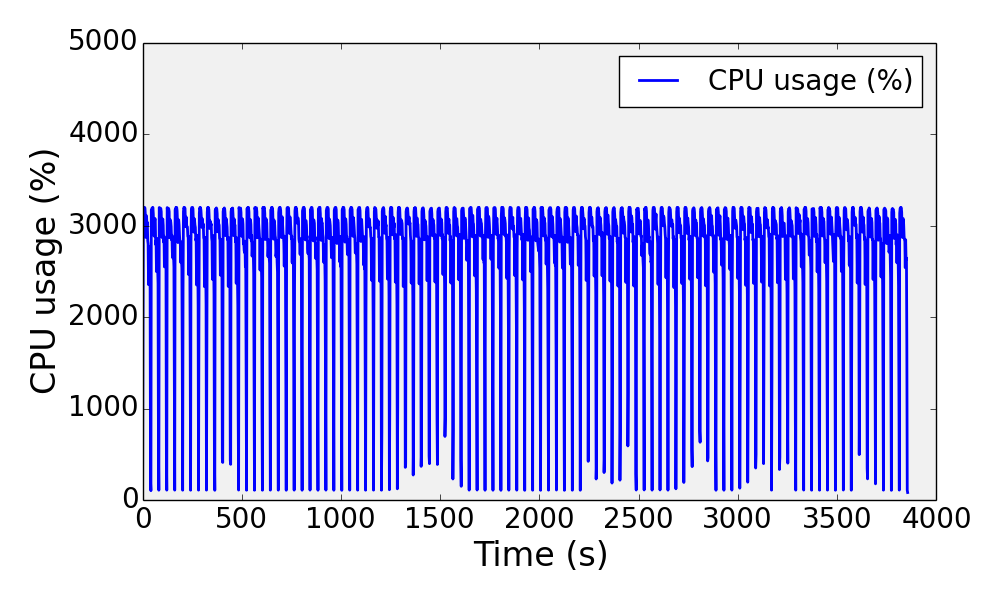
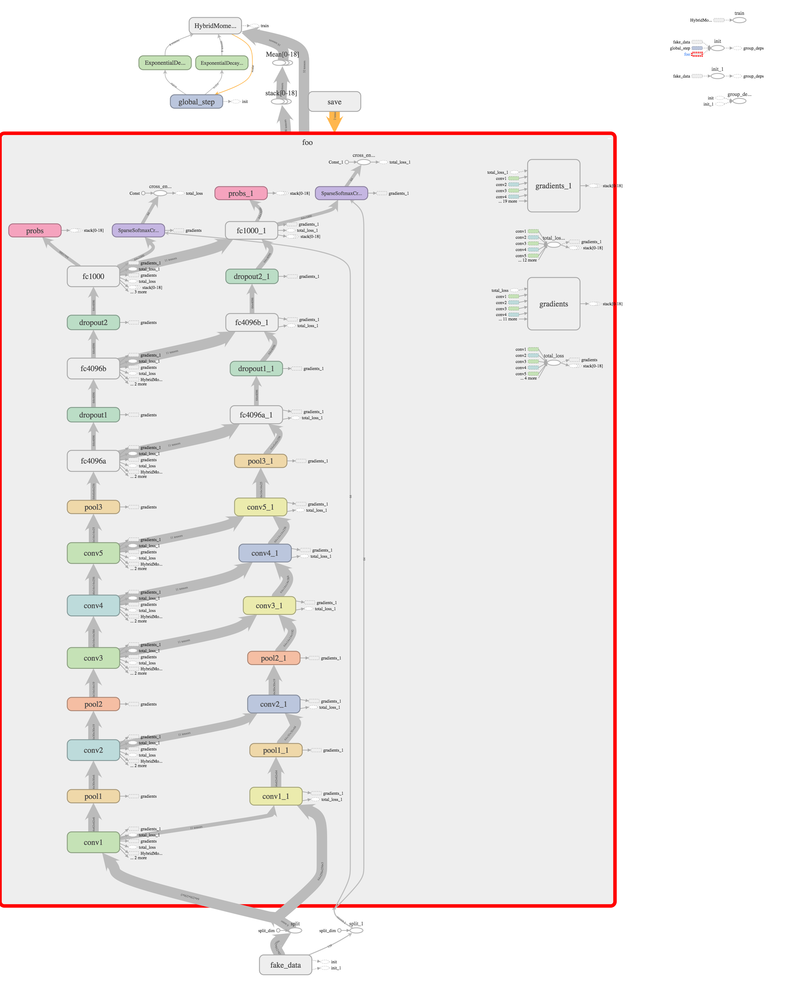

# EECS598-Assignment02
### Q1
469s

### Q2
521s
Comparing with Q1, checkpointing costs some time..

### Q3
453s

Comparing with Q1, this experiment ran a little faster. I think it is because they have the same amount of data but Q3 only have 48 batches, which means smaller iteration number than Q1, and save some time in applying the gradients. At the same time, the size of each batch increased, which resulted a longer time for each batch.

### Q4

### Q5
#### Repeating Q1 for VggNet
3857s

#### Repeating Q2 for VggNet
3963s

#### Repeating Q3 for VggNet
3811s

#### Repeating Q4 for VggNet

### Q6
285s

We kept 96 batches and modified batch size in each worker to 64. Thus, a batch has the same amount of data to train. In this case, it is faster than Q1. However, as there are some overhead about communication, spliting data and computing the average gradients, it can not be 2X faster.

### Q7
185s

We kept 96 batches and modified batch size in each worker to 32. It is also faster than Q1. For similar reason as previous question, it can not be 4X faster.

### Q8
1053s

We use similar parameter with Q7. For similar reason as previous question, it is faster than Q5 but it is not as fast as 4X.

### Q9
About 50 hours.

